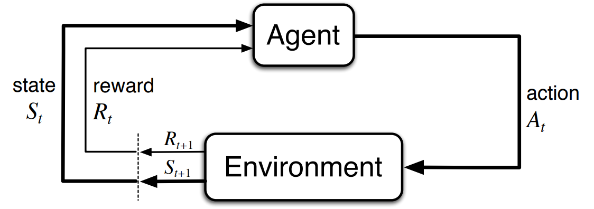

# 1st literature review

The thesis project will begin with a literature review. This review will begin by focusing on literature, mainly MSc theses, produced by the many students that Erik-jan has supervised, in addition to the introduction to reinforcement learning textbook by Brato & Sutton. The list of literature reviewed in this batch are as follows:

1. W.J.E. Völker: Reinforcement Learning for Flight Control of the Flying V
2. Thomas v.d. Laar: Deep Reinforcement Learning for Aircraft Landing
3. Lucas Vieira: Safe & Intelligent Control.
4. Peter Seres: Distributional Reinforcement Learning for Flight Control
5. Zhou Xin Ge: End-to-End Hierarchical Reinforcement Learning for Adaptive Flight Control
6. Ramesh Konatala: Design of Reinforcement Learning based Incremental Flight Control Laws for the Cessna Citation II(PH-LAB) Aircraft
7. Stefan Heyer: Reinforcement Learning for Flight Control
8. Jonathon Hoogvliet: Hierarchical Reinforcement Learning for Model-Free Flight Control
9. Barto & Sutton: Reinforcement learning, an introduction

Item 1 is for getting some exposure to rl controllers used in the context of flight control, specifically that of the flying-V which is main focus of the thesis. This item is reviewed first because of the fact that it presents the crossection of rl for flight control and the flying v, which should provide a good overview of both topics. Item 2 is for exposure to reinforcement learning, with the aim of reviewing this item being to understand the history of reinforcement learning as well as several algorithms have been used by past students. Item 3 is a placeholder a piece of literature that focuses on the aircraft design of the flying-V, which will be gathered from reading item 2.

With these 3 pieces of literature, good initial coverage of reinforcement learning as a field should be obtained, as well as the flying-v as an aircraft design. Upon reading these pieces, further literature study can then be directed more efectively.

---

## Item 1: Reinforcement Learning for Flight Control of the Flying V

### Questions & Answers-

**From chapter 2:**
1. What is the history and the derivation of the Bellman equation?
   1. The Bellman equation does not neccessarily refer to a singal equation. The equation most colloquially called the Bellman equation is the Bellman equation of the Value function, which is simply **the** definition of the value function for a given state. It returns the same value as the value function, so in the sense of what it computes the Bellman equation of a value function is equal to the value function. But the equation itself allows you to compute the value function, unlike the equation for the value function which is simply an expectation operator taken on the return of a state.
   2. The bellman equation for value function can be derived by starting from the expected value definition of the value function, expanding the return term by using it's recursive definition being the sum of current reward plus future returns, then expanding the expectation operator using the definition of the operator for a discrete random variable. This derivation is shown in figure 1 [from].
    <figure>
    
    <figcaption><b>Figure 1</b>, derivation of the bellman equation.</figcaption>
    </figure>

[from]: https://stats.stackexchange.com/questions/243384/deriving-bellmans-equation-in-reinforcement-learning

2. What is the distinction between the weight vector **w** and parameter vector **theta**??
   1. **w** is the weight vector that parametrizes a function approximator for the state or action value functions, typically the approximator is something like an ANN hence usage of the term "weight vector". **theta** is the parameter vector for a policy, which does not neccessarily or usually mean an ANN, could also just be some function. But from reading other theses, it seems that generally both the policy and value functions can take an ANN form, thus the diffference in naming is only conventional.
3. Willem states an interesting distinction between actor and critics, "The actor network then uses gradients to update the policy parameter vector θ and the critic network the value-function parameter vector w". So the actor only updates its policy, and the critic only updates its value function? 
   1. Turns out yes, an actors job is to provide the action that an agent takes, and the critics job is to provide a value function estimate that can be used to "gauge how adequate" the actions are.

**From chapter 4:**

1. Nasa has a thing called the "Common Research Model", what is this?
   1. The NASA CRM is a generic aircraft design model [1], for which an extensive open-source aerodynamic database has been gathered through several wind tunnel tests of the aircraft model. The NASA CRM can almost be thought of as another aircraft type, much like the Boeing 747 or the Airbus A380. It is a wide-body commercial transport aircraft with a supercritical transonic wing, designed for a cruise Mach number of M_infty = 0.85.
2. Pitch break, what is that?
   1. It's the onset/presence of longitudinal static instability in an aircraft, commonly happening at high angles of attack, where the C_M_alpha of the aircraft becomes positive (hence static instability).
3. Is there a model of the flying-V which models its' pitch-break behaviour?
   1. Reading Willems' thesis, there is only a limited fieldity of control surface effectiveness in the part of the flight envelope where pitch break occurs (above 15 degrees alpha), so not really.
   
**From chapter 6:**

1. Figures 6.1 & 6.2 have a subfigure graphing the actuation of in/outboard elevons. These are confusing figures though because it shows that the deflections of in/out board elevons are opposite!?

### Notes-

**From chapter 2:**

<!-- - Reinforcement learning is built in the framework of Dynamic Programming. From DP, RL borrows the idea of iterative policy evaluation and policy improvement cycles to obtain the optimal policy for it's agent, and makes this iteration tractable by heuristically approximating the cycle giving rise to the group of RL algorithms knwon as incremental dynamic programming (iDP). -->
- *Generalised policy iteration* (GPI) is a dynamic programming approach to finding an optimal policy and the true value function "simultaneously", which is aschieved by alternating between performing *policy evaluation* and *policy improvement*. Policy evaluation is done to improve the approximation of the value function, which is done by simply computing the bellman equation for value function, Eq 2.10 from Willem. Policy improvement is done to improve the policy itself, which is done by setting the policy to be equal to the action (which remember is a probability distribution!) which has the highest expected return, Eq 2.13 from Willem. GPI is a useful theoretical foundation for more advanced techniques such as *heuristic dynamic programming* (HDP), but GPI in its pure analytical form is too computationally expensive to compute/reach convergence especially for as complex a MDP as flight control, and require complete models of transition probabilityies (i.e. the complete dynamics of the MDP). 
- *Monte Carlo* (MC) methods are a class of methods that learn a value function by repeatedly and randomly the returns from visiting a given state, in contrast to GPI which learn the value function from analytically evaluation the expected returns as well as the bellman equation for value function. These methods do not *bootstrap*, as they do not base one value function estimate on another.
- *Temporal difference* (TD) methods combine the ideas of GPI (or dynamic programming) and MC methods, and updates an estimate of the value function (or estimate of any variable) through a finite difference scheme of x_1 = x_0 + dt(dx). (p.s, found interesting paper from the dawn of time that maybe i should read [2], he also introduces *n-step TD* with notation which i dont understand, what is G_{t:t+n}).
- Distinction between on and off policy learning: an RL agent in on policy learning optimizes the policy which it is using, while in off policy the agent optimizes a policy which it is not using. So for instance an offpolicy agent can use a pre-trained policy to explore a policy space and then use this exploration to improve a separate policy. Here a definition can be introduced, where the pre-trained policy is a "behaviour" policy, and the separate policy is the "estimation policy.
    Willem's thesis emphasizes on describing what off-policy is and its' implications. Where until recently off-policy algorithms have been largely too varied for large continuous state and action spaces.
- "small" literature review of deep learning available [here]
- Quote "(policy-based) methods have the important advantage over value-based methods that they can be applied to continuous action spaces". May need to verify
- Quote "An important practical advantage of using a parameterised policy is that it offers a way of adding prior knowledge about its desired form". (i think) This could mean for example favouring the roll clockwise when the airplane rolled anti clockwise.
- Willem asserts that the latest off policy, model free RL algos for continuous spaces include DDPG, TD3, and SAC.

[here]: https://www.researchgate.net/publication/277411157_Deep_Learning

**From chapter 3:**

- In this chapter Willem describes a lot of the high level decisions he made during the thesis, such as which algo to choose, how to engineer the rewards (cost function), and compute resource.
- Willem used a 8Gb Ram laptop with no gpu.
- TD3 was chosen over SAC in the end, **a)** TD3 is deterministic (SAC is stochastic) so less dangerous for flying, **b)** "highly oscillatory actions" of SAC. But he notes that the differences between these two algos are otherwise small.

**From chapter 4:**

- 3 sources for a flying-V model are available. From which Willem chose model 1.
    1. [model 1], simulation based on stability & control derivatives from a VLM based CFD simulation of the full scale flying V, (i assume is linear)
    2. [model 2], simulation of model 1 improved with wind tunnel measurements
    3. [model 3], simulation based on derivatives obtained from flying the RC-controlled 4.6% scale model flying-V.
[model 1]: http://resolver.tudelft.nl/uuid:69b56494-0731-487a-8e57-cec397452002
[model 2]: https://arc.aiaa.org/doi/epdf/10.2514/6.2022-1429
[model 3]: https://repository.tudelft.nl/islandora/object/uuid:3cf35fb2-4fe7-49d7-9076-068c44fb2016?collection=education
- The thesis and some other materials refer to a "NASA common research model", but dont ever say even at the briefest mention what it is, so frustrating. Remember to document in the weekly report!!!!!
- J. Benad [3] from TU Berlin carried out the first preliminary design of the flying-V concept in collaboration with Airbus.
- Willem uses the FCS sized by Cappuyns [4].
- Willem cites from Dally [5] that "direct control inputs resulted in unstable behaviour during tests", wherein the RL agent's action signals only span [-1, 1] (square bracket is inclusive, round bracket is exclusive) and the mapping from this normalized range to actuator action is one-hundreth of the actuator change increment. This actually raises a slightly interesting note, because clipping the gaussian to [-1,1] naively will lead to the values -1 and 1 to be sampled a bit higher than they should be. So instead, one should use the truncated normal distribution.
- The flying V's damping coefficient for short period, phugoid, and dutch roll would not meet regulatory requirements of level 1 handling quality *in some flight conditions and CG locations* without an SAS [6].
- Flying V has a pitch break behaviour where it becomes statically unstable (*longitudinally*) beyond certain alphas (~15) [6].

---

## Item 1 References

[1] M Rivers. (2019). NASA Common Research Model: A History and Future Plans. *AIAA Aviation 2019 Forum*. doi: 10.2514/6.2019-2188 

[2] A Samuel. (1959). Some studies in machine learning using the game of checkers. *IBM Journal on Research and Development*. url: https://api.semanticscholar.org/CorpusID:2126705

[3] J Benad. (2015). The Flying V - A new Aircraft Configuration for Commercial Passenger Transport. Deutscher Luft-undRaumfahrtkongress 015, Rostock. doi: 10.25967/370094

[4] T Cappuyns. (2019). Handling Qualities of a Flying V Configuration. TU Delft, http://resolver.tudelft.nl/uuid:69b56494-0731-487a-8e57-cec397452002 

[5] K Dally. (2021). Deep Reinforcement Learning for Flight Control. TU Delft, http://resolver.tudelft.nl/uuid:fcef2325-4c90-4276-8bfc-1e230724c68a 

[6] S van Overeem, X Wang, E-J van Kampen. (2022). Modelling and Handling Quality Assessment of the Flying-V Aircraft. *AIAA Scitech 2022 Forum*. doi: 10.2514/6.2022-1429 

[7] M Palermo, R Vos. Experimental aerodynamic analysis of a 4.6%-scale flying-v subsonic transport. *AIAA Scitech 2020 Forum*. doi: 10.2514/6.2020-2228. 

---

## Item 3: Deep Reinforcement Learning for Aircraft Landing

### Questions & Answers-

### Notes-

**From chapter 4:**

- 5 DRL's are compared by training on the LunarLander OpenAI gym environment.
- PPO is claimed to be [better] than TRPO as it is simpler to implement, and have better sample "complexity".
- Two tests are designed to compare the 5 chosen DRL algorithms, **test 1:** training all DRLs in the nominal gym and then testing them on a windy environment, **test 2:** training all agents on a windy environment and then testing them on various windy environments.

[better]: https://arxiv.org/pdf/1707.06347.pdf

**From chapter 7:**

- Using the repo He evaluated 5 DRL algos together, and concluded that SAC had the best perfromance in virtaully all parameters he kept track of. This is in contrast to what Vlad and Willem concluded, that TD3 was better.
- A full 3d ALS model with PID and landing scenario was implemented.
- The implemented SAC showed unstable learning behaviour, with rewards dipping in "lower" stages of learning (what is lower?), and the trained agents showed oscillatory actuation usage, something that was remarked on by Vlad and Willem.

**From Appendix A:**

- Pseudocode of the 5 DRL's are written.

---

## Item 4: Safe & Intelligent Control

### Questions & Answers-

**From chapter 3:**

1. I cannot understand figure 3.9. He plots mean episode length over samples. What is it plotting?
   1. I think i figured it out. It shows that in general as more samples are taken, the episode length increases and plateaus at the maximum episode length, which is when the highest return can be obtained. I.e., there is a correlation between episode length and return, hence him saying that "...SAC and DSAC learn to converge to a maximum return..."
2. Lucas used multiple seeds to evaluate the performance of all 4 controllers, but is there any stochasticity when it comes to evaluating the offline-trained controllers?
   1. TBD...

### Notes-

**From article:**

1. Both (D)SAC and IDHP use an actor-critic structure, however the critic network in IDHP is very different than the ones used by (D)SAC, wherein the network estimates a *derivative* of the value function, instead of the value function itself. Consequently the hybrid structure of this (D)SAC-IDHP controller is only hybrid as far as the actor networks are concerned, and *not the critic network*. In contrast, the critic in SAC is a Q-function critic

---

## Item 5: Distributional Reinforcement Learning for Flight Control

### Questions & Answers-

**From article:**

1. Casper makes the distinction between *agent state vector **s*** and *environment state vector **x***. But is he referring to the *observation vector **o*** when talking about ***s***? With ***o*** being the subset of ***x***. This is important because he says "the state vector used by the partial state derivatives and incremental model has to be explicitly defined as the *environment state vector **x*** in order for the incremental model to retain a meaningful estimation of the system dynamics."
    1. TBD.

### Notes-

**From chapter 1:**

- He defined high sample efficiency as needing "a low amount of data points during training in order to reach a certain level of tracking performance"
- Learning performance was defined as "high sample efficiency, stable learning process which is robust to changes in hyperparamater or observability"

**From article:**

- "RL-state and the action as inputs per definition of the Q-function with a single scalar output", implying that Q-function is defined as the action value function, need to confirm this implication with studying Q-functions!!
- SAC's actor netowork outputs Gaussians for each actions as a function of state/observations.

**From chapter 3:**

- Distributional RL can be distinguished from non distributional methods in 3 ways:
    1. They parameterize and use the return distributions, instead of only using expectation of a distribution
    2. The distance metric used (a quantile Huber loss in case of DSAC which used IQN) to optimize parameters
    3. Ability to avoid risk in both pre and post training
- DSAC, made by a team from [Tsinghhua] is an extension of SAC where it changes the critic network to a *distributional* critic network.

**From chapter 4:**

- Sampling efficiency is quantified by simply seeing how many episodes are needed to achieve a certain level of reward. Evidence for improved sampling efficiency of DSAC can be found in the research paper. From Figure 4.9 Peter claims that a 20% increase in sampling efficiency was achieved, but he was probably referring to Figure 4.7. 
- A number of methods to reduce the oscillatory actuation from DSAC controllers are prsented by Peter:
    1. Increasing penalty of high actuation in the reward function
    2. Adding a [CAPS] (control action policy smoothness) loss term to the reward function, which penalizes control policies which are not smooth temporally and spatially (changes quickly over time or quickly between states)

[Tsinghua]: https://arxiv.org/pdf/2004.14547.pdf
[CAPS]: https://arxiv.org/pdf/2012.06644.pdf

**From chapter 7:**

- *Estimator windup* is when the covariance of the estimator in an RLS increases exponentially and is caused by a combination of factors,  the combination of forgetting factor being set to < 1 and **a)** lack of system excitation or **b)** non-uniformly distributed information over all parameters **c)** time-scale separation in the variation of parameters. Consequence of windup is abrupt changes in estimate once the system becomes excited (according to [Heyer et al.]). And can be combatted by setting forgetting factor to 1.

[Heyer et al.]: https://arc.aiaa.org/doi/epdf/10.2514/6.2020-1844

---

## Item 6: End-to-End Hierarchical Reinforcement Learning for Adaptive Flight Control

### Questions & Answers-

**From chapter 5:**

1. What do the numbers in tables 5.6-5.9 mean?
   1. I think the fractions are supposed to indicate the rate of success.

### Notes-

**From chapter 1:**

- The term "options" is introduced by Sutton in this [publication]. This term refers to the set of primitive and temporally extended actions. It is also supposedly a method of Hierarchical RL.

[publication]: https://www.sciencedirect.com/science/article/pii/S0004370299000521

**From chapter 3:**

- A very nice descrciption of Actor-Critic design is given, paraphrasing: "The actor decides the control actions and is hence equal to a control law, while the critic learns a (state)-value function estimate to determine if executed action has added value and provides a TD error to update teh actor"
---

## Item 7: Design of Reinforcement Learning based Incremental Flight Control Laws for the Cessna Citation II(PH-LAB) Aircraft

### Questions & Answers-

**From chapter 3:**

1. Does he omit the discussion of IDHP? And why?
   1. 

**From chapter 4:**

1. It is implied that PE is only neccessary for the output feedback case of (i)ADP as Ramesh states that "... full state information is not available exploration of states is necessary", which has the implication that full state information is sufficient for exploration, but it appeared that according to [Zhou] PE is neccessary for ADP in general? 
   1. It feels like that Ramesh is misusing the term "PE", because it seems that

[Zhou]: https://repository.tudelft.nl/islandora/object/uuid%3A5b875915-2518-4ec8-a1a0-07ad057edab4

### Notes-

**From article**

- ADP methods require exploration of the states in order to learn the environment, which is done through [Persistent Excitation].PE is done by adding white noise to the action values to ensure that the system is excited at all times. Fortunately, PE is only performed during the training stages of the algorithms, e.g. an iADP controller is trained with PE included to arrive at a set of incremental models ***F*** & ***G***, where after these models can be used for actual flight with no PE included in the iADP controller.
- It would be **very interesting** to compare iADP and IHDP through [Zhou]'s dissertation, where she implements (and derives!) both algorithms.

[Zhou]: https://repository.tudelft.nl/islandora/object/uuid%3A5b875915-2518-4ec8-a1a0-07ad057edab4
[Persistent Excitation]: https://repository.tudelft.nl/islandora/object/uuid%3A5b875915-2518-4ec8-a1a0-07ad057edab4

**From chapter 3:**

- A nice -but hard to read- pseudo code of a basic acator-critic method is given in algorithm 1.
- *LADP* stands for linear approximate dynamic programming, which constantly learns a linear model of the system online. Here, the optimal control action to minimize an LQR cost is used to implement *GPI*. Where the state error cost matrix P is iterated representing policy evaluation, and the control action u is iterated representing policy improvement.
- *iADP* stands for incremental approximate dynamic programming, which is an incremental counterpart of LADP, and learns an incremental model, and uses a different form of the optimal control action which contains incremental models of system dynamics ***F*** & ***G*** instead of the linear ss models ***A*** & ***B***. Detailed derivations are publish by [Zhou et al]

[Zhou et al]: https://repository.tudelft.nl/islandora/object/uuid:6c3ef35c-7e0c-4962-b342-39be4bc45555

**From chapter 4:**

- I can tell from fig 4.9 that Ramesh is the one who did his thesis using MATLAB.

---

## Item 8: Reinforcement Learning for Flight Control

### Questions & Answers-

### Notes-

**From chapter 1:**
- He notes that ADP method's, despite being adaptive, still require offline training, touting it almost as an advantage of IHP. When in fact, an IDHP controller *also* should be trained offline first before its' first real flight, otherwise the controller dynamics will not be initialized, even if the IDHP agent was intialized with an offline trained actor like in the case of the hybrid controllers from Casper and Lucas.

**From chapter 2:**

- actor-critic designs (ACDs), introduced first by [Sutton], fall under the umbrella of approximate dynamic programming (ADP). ACDs can be further grouped into heuristic dynamic programming (HDP), dual heuristic programming (DHP), and globalized dual heuristic programming (GDHP). 

**From chapter 9:**

- Estimator wind up occurs when forgetting factor of RLS is < 1, Stefan avoids this by setting the forgetting factor = 1. But this has the disadvantage that the RLS does not forget old system models, and overtime the model parameters of RLS change less. This was directly addressed by setting the covariance matrx to its initial values when the estimators innovation sees large changes.

[Sutton]: https://mitpress-mit-edu.tudelft.idm.oclc.org/9780262631617/neural-networks-for-control/

---

## Item 9: Hierarchical Reinforcement Learning for Model-Free Flight Control

### Questions & Answers-

**From article:**

1. Jonathon says that "episode lengths differ per hierarchical layer", and that "q-de controller is evaluated for 10.5 seconds, gamma-q for 94.1 seconds..."  but how is that possible? Is the entire agent not trained or ran at once?
   1. He does not explain in his thesis, need to look for hints from other sources...

### Notes-

**From article:**

- A sinusoidal training signal made agents during training more stochastic.
- It would seem that one way in which HRL can be used to address curse of dimensionality is to simply reduce the number of cross-relations which exists in a Q table. E.g., if an environment has 5 number of states and 1 action, the dimension of the full Q-table would be 7. But seperating the environment into subproblems can allow for the Q-table to be reformulated, where instead of a single 7 dimensional Q-table, you could instead have e.g. 5 two-dimensional Q-tables. 
- An attempt of using a discrete Q-table to encapsulate the entire task of aircraft altitude control was made, where it was found that the sample efficiency of this approach is absolutely diabolical, requriing 120 million samples to reach a comparatively poor tracking performance.
- The time traces of all 3 controllers altitude tracking seems relatively poor, especially when compared to the likes of killian's controllers.

---

## Item 10: Reinforcement learning, an introduction

### Questions & Answers-

### Notes-

**From chapter 1-introduction:**

Elements of reinforcement learning:

1. Policy
    - Defines the agent's way of behaving at a given state, can be a lookup table, or a continuous function, or even a *search process*. It is allowed to be stochastic, where actions are given probabilities of being executed, or deterministic, where a certain action is taken for certain states.
2. Reward signal
   - Defines the goal of the reinforcement learning problem, from an optimization standpoint a Reward signal is akin to the cost function. In every RL problem, an agent receives a reward signal in the form of a real number at each and everystep; it is the main and only ingredient in the value function.
3. Value function
   - Indicates what is the *long run* reward for being in a certain state or being in a certain state *and* taking a certain action, in the former case the value function is called *state value function*, the latter case leads to the *action value function*. It is the total or expected (in the probability sense) reward that an agent can expect to obtain by being in a certain state/state-action pair. There exists distinct value functions for being in
4. Environment model (optional)
   - The mathematical models of the environment in which an agent is to act.

Reinforcement learning's river of history has 3 main streams, the first one is the *optimal control* stream, the second is the *trial-and-error learning* stream, and the third stream is the *temporal-difference* method. In the early stages, the field of optimal control was concerned with designing control laws which could minimize any certain measure of a dynamical system over time. A very famous progenator of this field is Richard Bellman, who along with others extended the theory of two mathematicians: Hamilton and Jacobi, who developed the theory which allowed development for equations to provided neccessary and sufficient conditions for the optimality of a control law. It was with Chris Watkins' work in 1989 that the streams of optimal control and trial-and-error learning combined to give rise to approaching the biological phenomenon of learning by modelling environments as MDP's and using optimal control theory to determine actions in such an environment, leading to the field of *reinforcement learning*, which addressed the curse of dimensionalty head on and attempted to control for relatively more complex system models than optimal control theory original addressed. 

The essential character of trial-and-error learning as selecting actions on the basis of evaluative feedback that does not rely on knowledge of what the correct action should be.

**From chapter 2- multi-armed bandits:**

This chapter gives an introduction on the RL problem -specifically maximizing return- using the illustrative RL problem of the multi-armed bandit, a simple and non-associative class of problems.

> **Definition: Nonassociative**
> Is an adjective used to describe how one variable does not depend on another, in contrast to associative where dependency may exist. Nonassociative tasks have no need to associate different actions with different situations, simply put there is only one situation and the agent just has to find the best action for that situation. For associative tasks, there is an associated *best action* for each situation (*state*).

Exploitation is to take the action which your current estimates say give the highest return or has the value, while exploration is to select one of the actions that is not estimated to give the highest return or value. By using an epsilon greedy method for selecting action, it can be shown that asymptotically the optimal action is chosen with a probability greater than 1-epislon, which for small epsilons will mean near certainty. This is ofcourse only the case in the limit, which practically is improbable to achieve.

> **Definition: Action-value function**
> A value function that estimates the return (value) of a taking a certain action given a certain state.

Estimating the return of an action can be trivially done by simply taking the realisation average, i.e. sum all rewards obtained from selecting an action, and then divide by the number of times that action was selected, which will yield an estimate of the actions' return. This method, however, is memory inefficient and can be memory intensive as the number of sample and actions grow. A smarter method of estimating return can be done by using an incremental formula, where the next return estimate is equal to the previous return estimate plus a factor of 1/n times the sampled reward minus previous return estimate:

$Q_{n+1} = Q_n + \frac{1}{n}(R_n - Q_n)$

This format of previous estimate plus a factor of difference in sample and estimate, is a frequently occuring expression in reinforcement learning, for example in the case of bootstrapped learning.

Two methods for selecting actions are thus far introduced. First method is to deterministically select action with highest return estimate Q(a); so called action-value methods. Second method is to prefer actions with higher value estimates through a softmax function of $H(a)$; so called gradient based action-value methods.
- equation 2.8-2.9 gives an interesting equation for having a moving average which is unbiased to initial conditions.

**From chapter 3-finite markov decision processes:**

This chapter gives an introduction on (finite) MDP, the mathematical framework used to describe all RL problems. The finite MDP is evaluative just like the multi-armed bandit problems where actions have rewards, but are also associative as there exists an optimal action for each situation (state). The important distinction which fintie MDPs bring over multi-armed bandits is the temporaly related nature of rewards, where the problem of exploitation vs exploration goes beyond estimating the optimal action for the initial state, but includes estimate the optimal action**s** which will bring the agent to future states and the highest long term return. Formally speaking, the bandit problem only required estimating an action value function that is purely a function of action $q*(a)$, and in the finite MDP case it is neccessary to estimate an action value function that is also a function of **states** $q*(s,a)$, or equivalently an estimation of the optimal state value function $v*(s)$.

MDPs take on the general form as shown in figure 1, the entire system in an MDP is described by a set of 5 variables, the agent, the environment, and 3 time varying signals of action, state, and reward. An agent is defined typically by its policy and value functions, and the environment is defined by the dynamics functions which perscribes some state and reward given an action. MDPs suppose that any decision making process can be reduced to simply this set of five variables, and has proved to be a useful abstraction of reality in reinforcement learning. It is similar to the state space models of systems found in control theory, which has 3 signals: state, control input, and measured output, as well as 4 matrices which describe the state transition function, control input function, as well as the observtion functions.

<figure>

<figcaption><b>Figure 1</b>, fundamental dynamics of an MDP, which is defined fully by all the signals and blocks shown here (agent, environment, rewardaction, reward, and state).</figcaption>
</figure>

*The environment*

It is completely characterized by the probabilities given by a discrete (or continuous) probability density function $p(s',r'|s,a)$, i.e. the probability of next state=s' next reward=r' given that the current state=s and the agent's action=a, p's functional mapping is thus p: S x R x S x A -> [0,1].

By summing/integrating this probability density function over all possible rewards, it is possible to obtain a marginal probability density function which is called the state transition probability function in MDPs $p(s'|s,a) = \sum_{r\in R}p(s',r'|s,a)$, which describes the probability of the next state=s' given the environments' previous state=s and the agent took action=a.

The expected reward $r(s,a)$ of a given s,a pair can be obtained by taking the expectation of $p(s',r'|s,a)$, $r(s,a) = \sum_{r \in R} r \sum_{s' \in S}p(s',r'|s,a)$.

*The reward*

When specifying the reward in an environment, it is important to remember to only reward an agent once the end goal is acheived, not once some sub goals are met. As it could be possible that achieving sub-goals and not the final goal provide the highest rewards, leading to an agent not learning to achieve the final goal. 

*Return*

Return G_t is defined as the sum of future rewards, $G_t = R_{t+1} + R_{t+2} + ... + R_{T}$, where T is the terminal time step. G_t can also be generalized to incorporate the idea of *discounting*, where rewards further in the future are *discounted* more, $G_{td} = R_{t+1} + \gamma R_{t+2} + \gamma^2 R_{t+3} + ... + \gamma^{T-t}R_{T} = \Sum_{k=0}^{\infty} \gamma^k R_{t+k+1}$, where $0 \leq \gamma \leq 1$ is called the discount rate. 

It is useful to rewrite the return as an incremental or iterative function: $G_t = R_{t+1} + \gamma G_{t+1}$